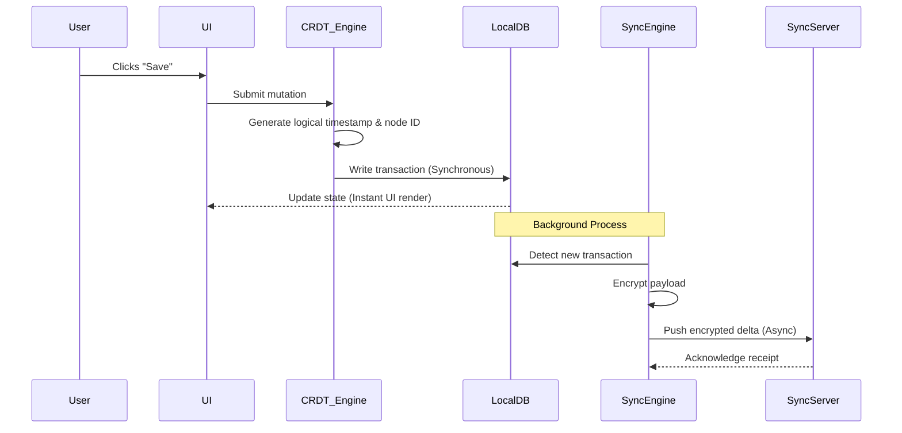
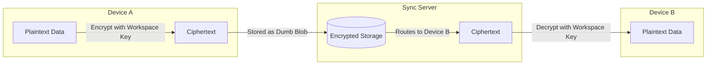

Why Local-First Software Changes How We Build Applications

  
  - For the past decade, the default architecture for web and mobile applications has been the client-server model.

  - The server holds the authoritative state and the client is essentially a remote terminal that renders UI and sends mutations over HTTP.

> Authoritative state means the one trusted source of truth for some piece of data.

For example, in a frontend + backend app:

- Frontend state: isLoggedIn = true
- Backend/database state: user session actually exists

If they disagree, the backend/session is authoritative because it is the source you trust.

Simple example: Suppose you have a collaborative editor:

  - Client A → "Document title = Hello"
  - Client B → "Document title = Hi"
  - Server   → "Document title = Hi"

If the server is defined as authoritative, then server state wins. Client A must eventually update from "Hello" → "Hi".

> Mutation means an operation that changes something on the server.

- This model gave us real-time collaboration and multi-device access, but it introduced severe engineering tradeoffs:

  - network latency dictates UI responsiveness : 
  
    - How fast the UI feels can depend heavily on how long it takes for the network request to complete.

    - If your UI depends on server responses before showing changes, network latency becomes a major factor in how responsive the application feels.

    - offline states require complex caching layers
    - centralized databases become massive security honeypots (fake resources intentionally placed to attract attackers so security teams can detect and study malicious activity)


Local-first software is an architectural pattern that inverts this paradigm. 

  - In a local-first system, the primary, authoritative copy of the data lives on the user's device.

  - The server is no longer the main source of truth. It only helps clients synchronize data and keeps a backup copy.


This approach combines the instantaneous performance and absolute data ownership of traditional desktop software with the multi-device synchronization and collaboration capabilities of cloud applications.

> Multi-device synchronization means keeping the same data/state consistent across multiple devices belonging to the same user.
  
  - each device maintains its own local state, while synchronization makes sure changes propagate between them.

  - When we are offline , if we edit both devices independently, When they reconnect, the system needs a way to merge those changes without losing data.

  - That's where things like CRDTs, operational transformation, version vectors, conflict resolution, and synchronization protocols come in.

------------

Why Cloud-First Apps Feel Broken Sometimes

  - To understand why local-first exists, we have to look at the failure modes of cloud-first applications.


The Cost of Network Latency
  
  - In a standard React or Vue application backed by a REST or GraphQL API, clicking a button often means waiting for a network round-trip

  - Even if you implement Optimistic UI means updating the interface immediately and rolling back if the server rejects the change, the application is still fundamentally bound by network latency

  -  If the user's connection drops, the optimistic update hangs, and the user experience degrades.


The Moment Everything Stops Working Offline

  - Cloud applications treat the network as a mandatory dependency. When a mobile device enters a tunnel or a basement, the application stops functioning

  - Engineers spend weeks building complex service workers, IndexedDB caches, and background sync queues  just to make the app usable offline, and it rarely works perfectly.

> Service Worker is a background JavaScript process that runs separately from your web page and sits between your web app and the network.

- It runs inside the user's browser, usually with its own lifecycle and limited APIs.

- Think of it as a middleman between your app and the internet.
  
  1. Helps in caching: It can store files locally, so app can work offline with the help of service worker cache instead of fetching from the server every time. This can make apps load faster and work offline.

  2. Offline support: If the network is unavailable, The service worker can return cached resources instead of showing a network error.

  3. Background synchronization: A service worker can help in performing tasks in the background, like syncing data with the server when the network is available.

  4. Push notifications: Service workers can receive push events and show notifications even when the web page isn't currently open.

> Service Worker is a browser-side background worker that can intercept network requests, manage caches, support offline behavior, handle background tasks, and receive push notifications.

---------------

Why Centralized Data Is a Risk

  - When you build a cloud-first app, , you are forced to build a centralized database containing the plaintext data of every user

  - This creates a single point of failure. A compromised API key, a rogue employee, or a successful SQL injection exposes the entire user base. 

  - Furthermore, because the server holds the data in plaintext, the provider(company) has the technical ability to scan, analyze, or monetize that data.


Understanding the Local-First Approach
  
  - Local-first software prioritizes local storage (the disk built into the user's computer or phone) and local networks over remote servers.

> Local Storage is a browser feature that lets a website store small pieces of data on the user's device so the data survives page refreshes and browser restarts.

  - Common uses are saving theme preference, remembering UI settings, persisting drafts, storing simple client-side state

  1. In local storage, data is stored in key-value pairs and can be accessed using JavaScript.

  2. Only strings can be stored in local storage. Objects and arrays must be converted to strings (serialize objects) using JSON.stringify() before storing and converted back to objects and arrays (deserialize objects) using JSON.parse() after retrieving.
 
  3. Reading/writing localStorage happens synchronously, so excessive usage can block the main thread.

  4. Not for sensitive data: Don't treat it as a secure storage mechanism. LocalStorage is not encrypted and can be accessed by any javascript running on the same origin, so it should not be used for storing sensitive information like passwords or tokens.

  5. localStorage does not synchronize across devices


In this local first architecture, the local database is the source of truth. The user interface reads from and writes to the local disk.

  - It means the app automatically syncs your changes in the background, without you having to manually save or refresh.
     
    - A process running behind the scenes that watches for local changes and syncs them. It copies those changes to the server without interrupting the user.

    - The server receives and stores/forwards those changes. The server sends the changes to other connected devices. Your phone, laptop, tablet, etc. eventually receive the same update.


------------

The 7 Ideas That Make Local-First Work

  - When we design a system where the local device is the primary node, we target seven specific technical outcomes:

> A primary node is the main node responsible for authoritative operations or state in a distributed system.

  - The primary typically handles writes, while replicas/secondary nodes may handle reads or maintain copies.

  - The primary node is the source of truth, and other nodes generally follow its state.


1. Zero-Latency UI: Because reads and writes hit the local disk, operations are limited only by local I/O speeds. There are no loading spinners waiting on network requests.

2. Multi-Device Synchronization: Data is continuously replicated across all user devices.

3. Network Optionality: The application functions identically whether the device is online, offline, or transitioning between networks.

4. Automatic Conflict Resolution: Concurrent edits from multiple users or devices are merged mathematically without requiring manual intervention.

> Concurrent edits means multiple users or devices modify the same data at roughly the same time, before seeing each other's changes.

 -  conflict handling done by Systems like CRDTs and Operational Transformation (OT) are designed to handle this.

 - concurrent doesn't necessarily mean literally at the exact same millisecond. It usually means the changes were made before one change had been observed by the other participant.


5. Long-Term Preservation: The software and data can run indefinitely, even if the original developer shuts down their servers.

6. Zero-Knowledge Security: The server only stores encrypted blobs. It cannot read the data it is routing.

  - Server handles the data but never has access to the readable/plaintext version of it.

  - The server has as little knowledge about the actual data as possible. In a true end-to-end encrypted design, encryption/decryption keys are controlled by the clients, not the server.

  - The server just sees encrypted bytes. It knows where to route the data, but it cannot decrypt the actual content.

  - The server can store and transport your data, but it doesn't have the keys needed to understand what that data actually contains.

7. Byte-Level Ownership: The user possesses the raw database files and can back them up, migrate them, or parse them with custom scripts.

  - Byte-Level Ownership means the user has direct access to the actual underlying database files (data files, indexes, metadata, WAL/logs, etc.), rather than only accessing data through an app/API.

  - The actual files containing the database's data are under the user's control. They can simply copy the files somewhere safe. They can move the database to another machine, storage system, or setup.

  - They aren't limited to the application's UI or API. They can write their own program to inspect or process the underlying data.


-------------------

Inside a Local-First Architecture

- Building a local-first application requires a fundamental shift in how we structure our frontend and backend code.

Core Building Blocks: A local-first application consists of five distinct layers

1. User Interface (UI): Subscribes to local state changes and renders the view. It never makes direct network calls for data fetching.

2. Local Database: A persistent, embedded database (e.g., SQLite, IndexedDB, LMDB, or RocksDB) that runs on the user's device, storing all data locally. This is the single source of truth for the application.

3. CRDT / Merge Engine: A layer that sits on top of the database. It intercepts writes, applies Conflict-Free Replicated Data Type logic and ensures that concurrent mutations do not overwrite each other.

> If something intercepts a request, it gets a chance to inspect or modify it before the request reaches its destination , for example: The service worker catches the request before it goes directly to the server and can decide what to do with it.


4. Sync Engine: A background process that watches the local database for changes, generates deltas (diffs), encrypts them, and transmits them to peers.

> A delta is just the change between the old state and the new state. It is a compact representation of what changed, rather than the entire dataset, which is too efficient for network usage.

- users makes changes, find what changed, create a small diff (delta), encrypt that diff it, and send it to other devices/users.


5. Sync Server (Backend): A "dumb" relay. It recieves deltas, authenticates users, routes encrypted deltas between devices, and stores encrypted blobs for backup. It contains no business logic.

  - Sync server is intentionally kept very simple. It doesn't understand or modify the actual application data.

  - Server doesn't need to understand what the data means. The server can also keep encrypted copies of encrypted document, encrypted deltas, encrypted snapshots etc. But because the data is encrypted client-side, the server can't read the actual content.

> The sync server is basically a trusted traffic controller: it knows who is connected and where encrypted data should go, but it doesn't understand or control the actual data.

---------

What Happens When a User Makes a Change

  - In a cloud app, a write operation is a network request. In a local-first app, a write operation is a local database transaction.


In CRDTS, Every change gets a unique ID that tells the system both when it logically happened and which device created it.

Suppose you have two devices, Phone(with node id 1) and Laptop(with node id 2), and both are editing the same document. 
  
  - You add the word "Hello" on your Phone and it generates (unique deterministic operation identity which looks like timestamp when the change was made + device node id). So operation id looks like (17548455291, 1).
  
  - Your brother adds the word "World" on your Laptop and it generates (unique deterministic operation identity which looks like timestamp when the change was made + device node id). So operation id looks like (175484552921, 2).

  - Even though both have same timestamp, the node ID makes them distinguishable.


Why this? Because distributed devices don't share one perfectly synchronized clock.
  
  - The system needs to know like "are these two changes from same device or different devices?", 
  
    - if both have same timestamp and different node ids, then they are from different devices.

    - if both have different timestamp and different node ids, then they are from different devices.

    - if both have different timestamp and same node ids, then they are from same device.


The pair of (timestamp, node id) is called a unique deterministic operation identity.

  - It provides a deterministic (means same result every time) way to order operations across different devices when the CRDT needs without relying on a central authority or perfectly synchronized clocks.


logical timestamp is a counter or timestamp that is incremented every time a change is made representing the logical progression of operations

```js
{
  operationId: [42, "laptop-A"],
  type: "insert", // like insert, delete, update, etc. 
  position: 10,
  value: "X"
}
```




- What is happening here: The UI submits a mutation to the CRDT engine. The CRDT engine tags the mutation with a logical timestamp and the device's unique ID, then writes it to the local database.

- Because this is a local disk write, it takes microseconds. The UI updates instantly. The sync engine, running in a separate thread or worker, notices the new database transaction, encrypts it, and sends it to the server.

> Why it matters: The user never waits for the server. If the server is down, the write still succeeds locally. The sync engine will simply retry sending the encrypted delta later when the server is back online.

-------------

## CRDT architecture
1. CRDT Engine: Handles the actual data logic.

- Generates operations/deltas when user edits.
- Gives operations unique IDs/timestamps.
- Handles concurrent edits.
- Merges changes deterministically.
- Maintains the correct local document state.

CRDT = “What should the final state be?”

2. Sync Engine: Handles moving CRDT changes between devices.

- Detects pending local changes.
- Sends encrypted deltas.
- Receives remote deltas.
- Updates the local CRDT.
- Handles offline → online synchronization.

> WebSocket can provide real-time transport, while a Service Worker can help with offline/background networking.

Sync = “How do changes reach other devices?”

3. Redis Pub/Sub can be used for asynchronous communication, Bull MQ can be used for background job processing

Redis Pub/Sub can be used to notify other connected servers subscribed to a document about new changes in real-time.

- Real-time fan-out(means sending the same message to multiple subscribers)
- WebSocket server coordination
- Broadcasting CRDT deltas
- Communication between multiple server instances

Bull MQ can be used to handle the background job processing and retry logic or reliable asynchronous job processing.

- It provides persistent jobs, retries, failure handling, delayed jobs, concurrency, job state


> If a subscriber is offline when the message is published, the message is lost. 

  - Sync server sends encrypted deltas to persistent storage (like Redis or a database) for offline clients. When the client reconnects, it fetches the stored deltas and applies them.

  - For online clients, the sync server can use WebSockets to push deltas in real-time.

1. For online clients, Store every delta in a persistent store  (database) and then use Redis Pub/Sub to notify other connected servers subscribed to a document about new changes in real-time.

  - Pub/Sub is only the fast notification path.The database is the durable history.

2. Track what each device has received: Give every operation a sequence number like seq 101, seq 102, seq 103, etc.

    - Suppose device A(laptop) has sent seq 101, seq 102, seq 103, seq 104, seq 105 to device B(phone).

    - Suppose phone was offline after seq 103, when device A sent the deltas. Now phone comes online and needs to sync with device A.

    - Device B will send its last acknowledged sequence number to device A, which is seq 103, then device A will fetch remaining deltas seq 104, seq 105 from its database and then sends them to device B, then device B will apply to CRDT engine and update its last acknowledged sequence number to seq 105 and continue real-time pub/sub.

-----------------

Solving the Hardest Problem: Synchronization with CRDTs

  - The hardest technical challenge in local-first software is merging concurrent edits

  - If Device A and Device B both edit a document while offline, how do we combine those changes when they reconnect without losing data or throwing a merge conflict?


> Traditional databases use pessimistic locking (preventing concurrent edits) or last-write-wins (silently dropping one edit)

  - Traditional database systems can prevent two users/transactions from modifying the same data at the same time by locking it.

```bash
Database row: Account 123

User A → locks row → edits
User B → waits
User A → commits → unlocks
User B → can now edit
```
   
  - They prevent multiple transactions from simultaneously modifying the same piece of data when that could cause a conflict.

>  Version control systems like Git require manual conflict resolution.

------------------------

The solution is Conflict-free Replicated Data Types (CRDTs).

Why Conflicts Happen

  - Conflicts arise when multiple users modify the same data independently on concurrent edits and the system doesn't have a deterministic way to merge those changes.


> CRDTs allow multiple devices to make changes independently and later merge those changes into the same consistent state, without needing one central server to decide which change wins.

  - The CRDT's mathematical rules ensure that, when all operations are eventually received, replicas converge to the same state.

  - CRDTs provide conflict-free convergence without requiring a central coordinator for every edit.


- They allow multiple nodes to independently modify their local state and guarantee that, once all nodes communicate their changes, all replicas will converge to the exact same final state.

> Strong Eventual Consistency (SEC)
  
- Operations: what users did.
- CRDT merge rules: how those operations are interpreted.
- Strong Eventual Consistency (SEC): the guarantee that replicas converge.

### Step1 

- Suppose a document starts as "Hello" and there are two devices laptop and phone, which editing the same doc. Now both go offline. 

- Laptop user inserts " world" and phone user inserts " Kartik" , so now their local states differ

```bash
Laptop → Hello World
Phone  → Hello Kartik
```

- There is no central server deciding the state. So when they reconnect, we need to answer: "What should the final document be?". That's where the CRDT's rules come in.

### Step2

- CRDT doesn't primarily synchronize "states". A naive synchronization system might send:

```bash
Laptop → "Hello World"
Phone  → "Hello Kartik"
```

- Now you have a problem: Which entire document should win? CRDTs generally work with operations/updates instead.

- So instead of saying from: `Laptop: "Here is my entire document."`, it says: `Laptop: "Insert ' World' at this position."` and `Phone says: Phone: "Insert ' Kartik' at this position."`

```bash
Operation A:
INSERT(" World", position, ID_A)

Operation B:
INSERT(" Kartik", position, ID_B)
```

- Now the system has both changes, not two competing versions of the entire document.

### Step3

- Every operation gets an identity: An operation can conceptually have

```bash
Operation A
├── nodeId = Laptop
├── logical timestamp = 15
├── type = INSERT
└── value = " World"

Operation B
├── nodeId = Phone
├── logical timestamp = 15
├── type = INSERT
└── value = " Kartik"
```

-  The timestamp alone is not enough to order operations across devices because both devices could generate the same timestamp. The nodeId is used to break ties when timestamps are equal.

- Different CRDT algorithms use different identifiers and metadata, so this is a conceptual model rather than a universal CRDT format.

### Step4

- Now the devices exchange operations, When the network comes back:

```bash
Laptop                    Phone
   │                         │
   │ Operation A             │
   ├────────────────────────→│
   │                         │
   │                         │ Operation B
   │←────────────────────────┤
```

- Now both devices have both operations. Both replicas now have the same set of operations. but they might have recieved them in different orders.

- A CRDT must ensure that this doesn't produce two different results.


### Step5

- This is where deterministic (means consistent and predictable) merge rules matter. The CRDT defines rules for combining operations.

```bash
Operations
    ↓
CRDT merge algorithm
    ↓
Deterministic state
```

- The merge algorithm might determine:

  - whether an operation has already been applied (by checking its unique operation ID)
  - whether two operations are concurrent (by comparing timestamps and node IDs)

  - where an insertion belongs (by position or index in the document)
  - whether a deletion removes an insertion (by referencing the unique operation ID of the insertion)

  - how conflicting updates are resolved (e.g., last-writer-wins, or merging values in a set)
  - how operations are ordered (e.g., by timestamp, node ID, or some other deterministic ordering)

The exact rules depend on the type of CRDT.

### Step6

CRDT Set

- Let's use a simple CRDT set as an example. A set is a collection of unique elements.

- Intial state: `{}` (empty set) , laptop adds "Apple" and phone adds "Banana" while offline.

```bash
Laptop → ADD("Apple")
Phone  → ADD("Banana")
```

- Their states are now:

```bash
Laptop → {"Apple"}
Phone  → {"Banana"}
```

After synchronization, both devices exchange operations, The CRDT's rule is essentially that keep every valid add operation, so the final state is the union of both sets. The data type's merge rule determined the result.

```bash
Laptop                    Phone
   │                         │
   │ ADD("Apple")            │
   ├────────────────────────→│
   │                         │
   │                         │ ADD("Banana")
   │←────────────────────────┤
```

- {Apple, Banana} is the final state on both devices. The CRDT merge rules ensure that both replicas converge to the same state, regardless of the order in which operations were received.

- Both replicas calculate:

```bash 
Final state = {"Apple"} ∪ {"Banana"} = {"Apple", "Banana"}
```

### Step7

- Example:Counter CRDT

  - Suppose intial state of counter is 10, laptop increments by 5 and phone decrements by 3 while offline.

  - after synchronization, both devices exchange operations: `10 + 5 - 3 = 12` is the final state on both devices. The CRDT merge rules ensure that both replicas converge to the same state, regardless of the order in which operations were received.

  - The operations are commutative (order doesn't matter) and associative (grouping doesn't matter), so the final result is the same on both devices.


### Step8

Text CRDTs are more complicated. This is where the CRDT's merge rules become more complex, because you have to consider the order of characters, insertions, deletions, and concurrent edits.

  - Suppose initial state of text doc is "ABC", Two users put their cursors at the same position between "A" and "B". Laptop inserts "X" and Phone inserts "Y" while offline.

  - Both are trying to insert at essentially the same logical position.

  - We can't simply say "Laptop's change wins" or "Phone's change wins", because after one insertion, the position of the other insertion changes. We need a deterministic way to order these concurrent insertions


Instead, Sequence CRDTs give inserted elements stable identities/positions that allow the system to deterministically order them, even if they were inserted concurrently (ordering by the operation IDs)

  - After synchronization, both devices exchange operations: Laptop inserts "X" and Phone inserts "Y" at the same position. 
  
  - The CRDT's merge rules determine a consistent order for these insertions, resulting in a final state

  - If X ID < Y ID, then X is applied before Y, so according to the operation IDs, the final state is "AXYBC" on both devices. If Y ID < X ID, then Y is applied before X, resulting in "AYXBC" on both devices.

  - The exact ordering depends on the particular sequence CRDT; the important thing is that the rule is deterministic and known to every replica.

  - If X ID = Y ID, then the node IDs are used to break the tie. If Laptop's node ID < Phone's node ID, then Laptop's insertion is applied first, resulting in "AXYBC". If Phone's node ID < Laptop's node ID, then Phone's insertion is applied first, resulting in "AYXBC".


### Step9

So what does "Strong Eventual Consistency" actually guarantee? SEC can be understood as two main properties.

1. Property 1: Eventual delivery

  - If an operation remains valid and the system eventually communicates successfully, replicas eventually receive the updates they need.

2. Property 2: Same updates to same state: 

  - If two replicas have received the same set of operations, they will converge to the same state, regardless of the order in which those operations were applied.

3. Idempotent means that applying the same operation multiple times has the same effect as applying it once. In other words, if you apply an operation to a state and then apply it again, the state remains unchanged after the second application.

> They mean replicas can receive updates in different orders, receive duplicate updates, merge updates multiple times and still converge.

### Step10

The really important distinction: "final state" isn't necessarily "last edit". This is where people often misunderstand CRDTs.

  - There isn't necessarily a global concept of `"Who edited last?"` because distributed devices don't necessarily have a perfectly synchronized global clock.

  - Instead, the CRDT uses causal relationships(means the order in which operations were applied), operation identities(means unique identifiers for each operation), and deterministic conflict-resolution(means consistent and predictable) rules.

  - The final state is the result of merging all operations according to the CRDT's rules. It may not match any single user's last edit, but it will be a consistent state that incorporates all valid operations.


> Concurrent does NOT mean conflict necessarily

> SEC sacrifices immediate consistency for availability and offline operation, while guaranteeing convergence once updates are shared.

-------------

How CRDTs Solve Them: A CRDT is a data structure that satisfies three mathematical properties:

1. Commutativity: The order in which updates are applied does not matter. Merge(A, B) == Merge(B, A).

2. Associativity: Grouping of updates does not matter. Merge(A, Merge(B, C)) == Merge(Merge(A, B), C).

3. Idempotence: Applying the same update multiple times has no additional effect. Merge(A, A) == A.

> Because of these properties, the sync engine does not need to order operations perfectly. It just needs to ensure that every node eventually receives every update.

----------

CRDT Implementation: A common CRDT is the Last-Writer-Wins (LWW) Register, used for single values like a document title or a user profile setting.

  - A naive implementation uses Date.now() to determine the winner. This is a critical production mistake.

  - Device clocks drift, and users can manually change their system clocks.  If Device A's clock is behind Device B's clock, Device B's older edits will overwrite Device A's newer edits.

> Instead, a LWW Register should use a logical clocks or Hybrid Logical Clock (HLC) combined with a unique node ID to maintain causal ordering and break ties. This ensures that the system can deterministically resolve conflicts without relying on synchronized physical clocks.

---------------

### Last-Write-Wins (LWW) Register: Simplest CRDTs

```bash
// A simplified Logical Clock implementation for a CRDT Register
interface LWWState<T> {
  value: T;
  logicalTime: number; // Monotonically increasing integer
  nodeId: string;      // Unique identifier for the device/user
}

class LWWRegister<T> {
  private state: LWWState<T>;
  private currentTick: number;

  constructor(initialValue: T, private nodeId: string) {
    this.currentTick = 0;
    this.state = {
      value: initialValue,
      logicalTime: this.currentTick,
      nodeId: this.nodeId,
    };
  }

  // Local update
  set(newValue: T) {
    // Increment the logical clock for every local operation
    this.currentTick += 1; 
    
    this.state = {
      value: newValue,
      logicalTime: this.currentTick,
      nodeId: this.nodeId,
    };
  }

  get(): T {
    return this.state.value;
  }

  // Merge remote state from another device
  merge(remote: LWWState<T>) {
    // Rule 1: If the remote logical time is strictly greater, it happened later.
    const remoteIsNewer = remote.logicalTime > this.state.logicalTime;
    
    // Rule 2: If logical times are identical (concurrent operations), 
    // use the node ID as a deterministic tie-breaker to ensure convergence.
    const tieBreaker = 
      remote.logicalTime === this.state.logicalTime && 
      remote.nodeId > this.state.nodeId;

    if (remoteIsNewer || tieBreaker) {
      this.state = remote;
      // Ensure our local clock is at least as high as the remote clock
      // to prevent our next local write from being considered "older"
      if (remote.logicalTime >= this.currentTick) {
        this.currentTick = remote.logicalTime + 1;
      }
    }
  }
  
  // Export state for serialization/syncing
  serialize(): LWWState<T> {
    return { ...this.state };
  }
}
```
 
What is happening here: 

 - Every time a device makes a local change, it increments a local integer counter (currentTick). 
 
 - When a remote change arrives, we compare the logical timestamps. If the remote timestamp is strictly greater, we accept it

 - If the timestamps are identical (which happens when two devices make a change at the exact same logical tick), we use the node ID string to deterministically pick a winner.


> Why it matters: This guarantees that no matter what order Device A and Device B receive each other's updates, they will both independently run the merge function and arrive at the exact same final value. The system converges without a central server.


- Production considerations: While simple logical clocks work for single registers, complex documents (like text editors) require Vector Clocks or Hybrid Logical Clocks (HLC) to track the causal history(means the order in which operations were applied) of multiple interleaved (means occurring at the same time) operations.

> Libraries like Yjs and Automerge handle this complexity under the hood.

--------------------

In distributed systems (like offline-first apps, multiplayer games, or collaborative editors), multiple devices ("nodes") might update the same piece of data at the same time. 

  - Because there is no central server to say "Device A wrote first," the devices must exchange their states and mathematically converge on a single, agreed-upon value.

  - This implementation uses a **Logical Clock** (which is implemented as a simple counter) to order events and a **Deterministic Tie-Breaker** (Node IDs) to resolve "ties" where two devices update the data at the exact same logical moment.

---

### Core Concepts

1.  **LWW (Last-Writer-Wins):** The rule is simple: the update with the highest timestamp overwrites any older updates.

2.  **Logical Clock (`logicalTime`):** Instead of using wall clock time (which can drift or be incorrect across devices), every time a node makes a change, it increments its own internal counter.

3.  **Deterministic Convergence:** If Device A and Device B both update the value when their clocks are at `5`, they have a conflict. To ensure they both eventually agree on who wins, they use a tie-breaker: they compare their unique Node IDs. Since the comparison is consistent (e.g., string comparison), both devices will independently choose the exact same winner.

---

### Code Walkthrough

#### 1. The State Interface
```typescript
interface LWWState<T> {
  value: T;
  logicalTime: number; 
  nodeId: string;      
}
```
- This defines the "payload" that gets sent over the network. It contains the actual data (`value`), when it was written (`logicalTime`), and who wrote it (`nodeId`).

#### 2. Local Updates (`set`)
```typescript
  set(newValue: T) {
    this.currentTick += 1; // Increment the logical clock
    this.state = {
      value: newValue,
      logicalTime: this.currentTick,
      nodeId: this.nodeId,
    };
  }
```

- When you change the value locally, the register increments its internal logical clock (`currentTick`) and stamps the new value with that time. This ensures that every local write has a strictly increasing timestamp.

#### 3. Merging Remote States (`merge`)

This is the most critical part of any CRDT. When this device receives a state update from another device (e.g., via Bluetooth, WebSockets, or a sync server), it calls `merge()`.

```typescript
    // Rule 1: Strictly newer time wins
    const remoteIsNewer = remote.logicalTime > this.state.logicalTime;
    
    // Rule 2: Tie-breaker for concurrent writes
    const tieBreaker = 
      remote.logicalTime === this.state.logicalTime && 
      remote.nodeId > this.state.nodeId;
```

The code applies two rules to decide if the incoming `remote` state should overwrite the local state:

1.  **Time Wins:** If the remote timestamp is higher, the remote state is newer and overwrites the local state.

2.  **ID Tie-Breaker:** If the timestamps are identical (meaning both devices wrote concurrently without knowing about each other), it compares the `nodeId` strings. The node with the lexicographically "larger" string ID wins. (e.g., `"node-B"` beats `"node-A"`).

#### 4. Clock Adjustment (The "Happened-Before" Logic)
```typescript
    if (remoteIsNewer || tieBreaker) {
      this.state = remote;
      // Crucial Logic:
      if (remote.logicalTime >= this.currentTick) {
        this.currentTick = remote.logicalTime + 1;
      }
    }
```

If the remote state wins, the local state is overwritten. However, there is a vital step for the logical clock: **Clock Catch-up**.

- If the remote device has a clock of `100`, and your local clock is only at `5`, you accept the remote state. 

- But if you immediately make a local write, your clock would tick to `6`. A timestamp of `6` is older than `100`, meaning your new write would be immediately overwritten by the old remote state during the next sync.

> To fix this, the code fast-forwards your local clock to `remote time + 1`. This ensures that your next local write will have a timestamp of `101`, guaranteeing it will be considered "newer" than the remote state you just accepted.

#### 5. Serialization (`serialize`)
```typescript
  serialize(): LWWState<T> {
    return { ...this.state };
  }
```
This creates a clean copy of the state to be converted to JSON and sent over the network to other peers.

---

### Potential Issues / Limitations in Production

simplified LWW-Register, there are two things to watch out for in a real-world application:

1. **String Comparison for Node IDs:** The line `remote.nodeId > this.state.nodeId` relies on JavaScript's string comparison. This works perfectly if your Node IDs are UUIDs or random strings. 

  - However, if your Node IDs are numeric strings (like `"2"` and `"10"`), JavaScript compares them lexicographically, meaning `"2"` is considered greater than `"10"`. Ensure your Node IDs are consistently comparable.

2.  **The "Anomaly" of LWW:** Last-Writer-Wins is very aggressive. If User A types "Hello" and User B types "World" at the exact same time, one of them is completely deleted. 

> There is no merging of the text; one simply overwrites the other. This is usually fine for simple settings (like "isDarkMode: true"), but poor for collaborative text editing.

-------------

### Where CRDTs Fall Short

CRDTs introduce specific engineering costs:

  - Metadata Overhead: CRDTs require metadata (timestamps, node IDs, vector clocks) to be stored alongside the actual data. This increases storage and network bandwidth requirements.

  - Tombstone Growth: When an item is deleted in a CRDT (like a character in a text document), it cannot be physically removed immediately. 

    - If Device A deletes a character, but Device B is currently typing next to it, Device B needs to know that character existed to apply its own edit correctly

    - Instead of physical deletion, CRDTs mark the item as a "tombstone". Over time, tombstones bloat the database. 

    - Production systems require complex garbage collection protocols (like waiting for a globally acknowledged watermark) to safely prune tombstones.

    > Globally acknowledged watermark: a point up to which every relevant replica has confirmed receiving/processing all updates.
  
  - Memory Usage: State-based CRDTs require sending the entire state over the network. Operation-based CRDTs (OpCRDTs) only send the operations, but require guaranteed, exactly-once delivery, which complicates the sync engine.


-----------

# 1. The Core Problem: Distributed Data & The Zombie Problem

In distributed systems (offline mobile apps, multi-region databases, collaborative editors), data is copied across multiple nodes. When disconnected nodes reconnect, they must merge their states.

 - If a node physically deletes a record, a problem arises. If Node B deletes `user:42`, but offline Node A still has it, syncing will cause Node A to push the old data back to Node B. The deleted user is resurrected(means it reappears). This is known as the **Zombie Data Problem**.

**The Solution:** We do not physically delete data immediately. Instead, we mark it.

---

# 2. What Are Tombstones?
A **tombstone** is a special marker indicating that a record was intentionally deleted.
```json
{ "id": 42, "deleted": true, "timestamp": 1723370400 }
```

When Node A and Node B sync, Node B presents the tombstone. Because the tombstone has a newer timestamp or specific deletion flag, Node A accepts the deletion. The zombie problem is avoided. 

To the end-user, the item simply disappears. The tombstone is an internal implementation detail used strictly for replication correctness.

---

# 3. Where Tombstones Are Used
Tombstones are foundational to modern distributed systems:
*   **Distributed Databases:** Systems like **Cassandra, DynamoDB, Riak, and HBase** use tombstones. A `DELETE` SQL query simply writes a tombstone to disk.
*   **Apache Kafka:** In compacted topics, a record with `value = null` acts as a tombstone, telling Kafka to drop all previous messages for that key during log compaction.
*   **CRDTs:** Used heavily in distributed data structures to handle safe deletions.

---

# 4. What Are CRDTs?
**CRDT** stands for **Conflict-free Replicated Data Type**. It is a data structure designed so multiple replicas can update it independently (even offline) and merge later without conflicts, achieving **eventual consistency**.

For a merge operation to be conflict-free, it must possess three mathematical properties:
1.  **Commutative:** Order doesn't matter (`merge(A, B) = merge(B, A)`).
2.  **Associative:** Grouping doesn't matter (`merge(merge(A, B), C) = merge(A, merge(B, C))`).
3.  **Idempotent:** Merging the same state twice has no extra effect (`merge(A, A) = A`).

**Two Main Types:**
*   **State-Based (CvRDTs):** Nodes send their entire local state to peers and merge them. Highly resilient to network issues.
*   **Operation-Based (CmRDTs):** Nodes send operations (e.g., `increment()`, `add()`). Requires reliable, often causally-ordered network delivery.

---

# 5. Common CRDT Data Structures

| CRDT Type | How it Works | Use Case |
| :--- | :--- | :--- |
| **G-Counter** | Grow-only counter. Each node tracks its own count. Merge takes the `max()` of each node's slot. | Page views, likes. |
| **PN-Counter** | Uses two G-Counters: Positive (P) and Negative (N). Value = `P - N`. | Inventory, online users. |
| **LWW-Register** | Last-Writer-Wins. Attaches a timestamp to a value. Highest timestamp wins. | Profile fields, simple settings. *(Note: Vulnerable to clock skew; production systems use Vector Clocks or Hybrid Logical Clocks instead).* |
| **OR-Set** | Observed-Remove Set. Uses unique tags and tombstones to handle adds/removes. | Shopping lists, tags, shared folders. |
| **Sequence CRDT** | Ordered list/text. Uses tombstones to maintain positional anchors. | Google Docs-style text editing. |

---

# 6. Tombstones in CRDTs: The OR-Set
Deletion in CRDTs is tricky because the *absence* of data is ambiguous (Was it deleted? Or did the node just not receive it yet?). 

The **OR-Set** solves this using unique tags and tombstones. 
1. Every time an item is added, it gets a **unique tag** (e.g., a UUID).
2. The state is split into two sets: `adds` (value + tag) and `removes` (tombstoned tags).
3. An item is visible if it is in `adds` and its tag is not in `removes`.

### The "Add-Wins" Concurrency Scenario
Imagine a shared shopping list. Both phones start with `("milk", tag_1)`.
*   **Phone A** deletes milk. It tombstones `tag_1`. (`removes = {tag_1}`)
*   **Phone B** (offline) adds milk again. It generates a new tag: `("milk", tag_2)`. (`adds = {tag_1, tag_2}`)
*   **They Sync:** The merged state has `adds = {tag_1, tag_2}` and `removes = {tag_1}`. 
*   **Result:** Milk is still visible because `tag_2` was never tombstoned. 

This is called **Add-Wins** semantics. If you need **Remove-Wins** (e.g., banning a user from a group concurrently with an invite), it requires more complex CRDT logic.

---

# 7. Tombstones in Text Editing & Key-Value Stores
*   **Collaborative Text (e.g., Figma, Google Docs):** Characters are nodes with unique IDs. If User A deletes "B", the CRDT turns "B" into a tombstone rather than erasing it. If User B concurrently inserts "X" after "B", the tombstoned "B" acts as a hidden positional anchor, ensuring "X" ends up in the correct place in the final merged document.
*   **Key-Value CRDTs:** A deleted key becomes a register containing `{value: null, deleted: true, timestamp: X}`. When syncing, the highest timestamp wins, ensuring the delete propagates safely.

---

# 8. The Bloat Problem: Tombstone Garbage Collection
Tombstones solve resurrection, but create a new problem: **Unlimited Storage Growth**. If users delete millions of records, your database becomes 90% tombstones, slowing down reads and compaction.

You must eventually delete tombstones (**Garbage Collection**), but doing so is dangerous:
*   **Time-Based GC:** Systems like Cassandra use `gc_grace_seconds` (e.g., 10 days). After 10 days, tombstones are purged. 
*   **The Danger:** If a node is offline for 11 days, misses the GC window, and reconnects with old data, the zombie problem returns because the tombstone is gone.
*   **Causal Stability:** Advanced CRDTs only garbage-collect a tombstone when the system mathematically proves that all possible nodes have seen the deletion event.

---

# 9. Edge Cases: Privacy & Application Semantics
*   **Privacy (GDPR / Right to be Forgotten):** Keeping tombstones forever violates data deletion laws. Solutions include **crypto-shredding** (encrypting data and deleting the key) or stripping Personally Identifiable Information (PII) from the tombstone marker, leaving only an anonymous ID.

*   **Application Semantics:** CRDTs solve *data merging*, not *business logic*. A CRDT can seamlessly merge two concurrent bank withdrawals, but your application code must still decide if overdrafts are allowed or if transactions should be rejected.


# 10. Mental Model

*   **Tombstone:** A deletion marker. It prevents deleted data from coming back to life when old, disconnected replicas sync.

*   **CRDT:** A mergeable data type. It allows distributed nodes to update data independently and merge it later without a central coordinator.

*   **How They Work Together:** CRDTs use tombstones (like in OR-Sets and Text CRDTs) to safely represent deletions. This ensures eventual consistency without data loss, zombie records, or merge conflicts.


-------------

### The Synchronization Engine

The sync engine is the bridge between the local database and the outside world. It must handle network partitions (means of handling disconnections), bandwidth constraints(means of managing data transfer), and peer discovery(means of finding and connecting to other nodes).

  
Internal Workflow

  1. Change Detection: The engine subscribes(or listens) to the local database's transaction log (e.g., SQLite's Write-Ahead Log or an RxJS observable stream).

  2. Delta Generation: It extracts the changed records and packages them into a delta.

  3. Compression & Encryption: The delta is compressed (e.g., using Brotli) and encrypted using the user's workspace keys ( means the keys used to encrypt/decrypt data for a specific user or workspace).

  4. Transmission: The engine sends the payload to the sync server via a persistent WebSocket connection or HTTP long-polling.

  5. Acknowledgment: The server acknowledges receipt and broadcasts the delta to other connected clients subscribed to the same document. The sync engine marks the local transaction as "synced" so it isn't sent again.


### Scaling Synchronization

Cloud servers have terabytes of storage; mobile phones do not. If your application is a note-taking app and a user has 50GB of attachments, you cannot sync the entire database to their phone.


> Solution: Working Set Replication : Only sync the subset of data that the user is actively working on. For example, if a user is editing a single document, only that document and its related metadata are synced to their device.
 
- The sync engine must understand the data schema. Instead of syncing the entire database, it syncs a "working set".

1. The client tells the server: "I need the metadata for all documents, but only the full content for documents modified in the last 30 days." 
  
  - means the client is requesting only recent documents to be fully synced while older documents are only partially synced with metadata

2. When the user opens an older document, the UI shows a loading state, and the sync engine requests the full payload for that specific document ID on demand.

### Handling Failures and Recovery

1. Network Partition: If the network drops, the local write still succeeds. The sync engine queues the encrypted delta in a local outbox table. When the network returns, it flushes(means sends) the queue.

2. Server Outage: If the sync server goes down, devices can still communicate peer-to-peer if they are on the same local network (via WebRTC or local Wi-Fi), or they simply wait for the server to recover. The data is never lost.

----------

### Security in a Local-First World: End-to-End Encryption (E2EE)

  - In a traditional cloud app, the server holds the database in plaintext. The security boundary is the network perimeter/ boundary and the database access controls. If the server is compromised, all user data is exposed.

  - In a local-first app, the security boundary is the user's device. The backend must be entirely zero-knowledge.

    
> How E2EE Works in Local-First

1. Key Hierarchy: When a user creates an account, the client generates a master key pair. The private key is derived from a local passphrase (using Argon2) and never leaves the device.

2. Workspace Keys: For collaborative documents, the app generates a symmetric "workspace key". This key encrypts the document content. This key is encrypted with the public keys of all collaborators and stored in the database.

3. Payload Encryption: Before any data leaves the device, the sync engine encrypts the delta using the workspace key (via AES-GCM).

4. Zero-Knowledge Relay: The sync server receives and stores only ciphertext. It routes the blobs based on user IDs but cannot read the contents.



> This architecture ensures that even if the sync server is compromised, the attackers only obtain useless encrypted blobs. The provider has no technical ability to scan or monetize the user's data.

-----------


In a collaborative document editor, multiple users edit the same file simultaneously. If the app uses End-to-End Encryption (E2EE), the sync server must act as a **"blind relay"**, it routes and stores data without ever seeing the actual document contents. 

1. Identity Keys: Asymmetric Cryptography

When a user (Alice) creates an account, her device generates an asymmetric key pair.

* **Passphrase to Key:** Alice’s password is never used directly as a cryptographic key. Instead, it is passed through a key derivation function like **Argon2** to securely generate her master private key.

* **The Key Pair:**
    *   **Public Key:** Shared with the server and other users.
    *   **Private Key:** Stays strictly on Alice’s device. The server never sees it.

*(The exact same process happens for Bob, generating `B_PUBLIC` and `B_PRIVATE`).*

2. The Workspace Key: The Shared Secret

When Alice creates a new workspace (e.g., "Project X"), her device generates a random **symmetric key** called the **Workspace Key (`W_KEY`)**. 

  - This key is what will actually be used to encrypt and decrypt the document data. However, because it is symmetric(means both users have the same key), both Alice and Bob need access to it, but the server cannot be allowed to see it.

### 3. Secure Key Distribution (Sharing the Workspace)

Alice cannot send `W_KEY` to Bob in plain text, and she cannot give it to the server to pass along. Instead, she uses asymmetric encryption(means using a public-private key pair) to share it securely:

1. Alice encrypts `W_KEY` using her own Public Key (so she can access it later from her own device).

2. Alice encrypts `W_KEY` using **Bob’s Public Key**.

3. Both encrypted blobs are sent to the server and stored in the database under the workspace members list.

**Result:** The server stores the encrypted workspace keys, but because it lacks Alice and Bob's private keys, it cannot decrypt `W_KEY`.

### 4. Bob Joins the Workspace
When Bob logs in, his device downloads his specific encrypted blob from the server: `Encrypt(B_PUBLIC, W_KEY)`. 

Bob’s device uses his local **Private Key (`B_PRIVATE`)** to decrypt it. 
**Result:** Both Alice and Bob now have the plaintext `W_KEY` in their local device memory. The server still does not.


### 5. Payload Encryption: Encrypting CRDT Deltas

When Alice types "Hello Bob", the local CRDT engine doesn't send the whole document over the network. It generates a small change, or **delta** (e.g., `{"operation": "insert", "text": "Hello Bob", "position": 0}`).

Before this delta leaves Alice's device, it is encrypted:

*   **Algorithm:** **AES-GCM** is used alongside the `W_KEY`.

> AES-GCM (Advanced Encryption Standard in Galois/Counter Mode) is a fast, symmetric authenticated encryption algorithm.

*   **Confidentiality:** The plaintext JSON delta is turned into an unreadable ciphertext blob (e.g., `8f92a1c7...`).

*   **Integrity (Authentication):** AES-GCM also generates an authentication tag. If a malicious actor (or a buggy server) alters the ciphertext bytes in transit, the decryption process will fail, and Bob's device will reject the tampered payload.

### 6. The Zero-Knowledge Server
The encrypted delta is sent to the sync server. The server only sees metadata and ciphertext:
*   `workspace_id`
*   `document_id`
*   `sequence_number / version`
*   `ciphertext_blob`

The server has no idea if the payload represents an insertion, a deletion, or a title change. It cannot read the JSON. It simply stores the blob in the database and routes it to other online members of the workspace.

### 7. Decryption on the Receiver's Side
Bob’s device receives the ciphertext blob from the server.
1.  **Decrypt:** It uses the local `W_KEY` and AES-GCM to decrypt the blob back into the plaintext JSON delta.
2.  **Verify:** AES-GCM verifies the payload hasn't been tampered with.
3.  **Apply:** The plaintext delta is fed into Bob's local CRDT engine, which merges it into his document state.

Bob's screen updates to show "Hello Bob".

---

### 8. Summary: The Key Hierarchy Mental Model

To understand E2EE in collaborative apps, separate the system into three distinct cryptographic layers:

| Layer | Cryptography Type | Purpose | The Question it Answers |
| :--- | :--- | :--- | :--- |
| **1. Identity Keys** | Asymmetric (Public/Private) | Access Control | *"Who is allowed to unlock the workspace key?"* |
| **2. Workspace Key** | Symmetric (AES) | Data Encryption | *"How do we securely encrypt the actual document?"* |
| **3. Payload Encryption** | AES-GCM | Transit Security & Integrity | *"How do we safely send individual CRDT deltas through an untrusted server?"* |

By separating identity from data encryption, the sync server is reduced to a simple, zero-knowledge storage and routing layer, ensuring true end-to-end privacy without breaking real-time collaboration.

----------

### Common Misconceptions and Pitfalls

Misconception 1: "Local-first means we don't need a backend."

  - Reality: You still need a backend. You need servers to handle authentication, route synchronization traffic (means sending data between devices), send push notifications, and manage billing.

  - The difference is that the backend is "dumb." It does not contain business logic or plaintext data; it is purely a relay and storage mechanism.

Misconception 2: "Local-first is just like Git."

  - Reality: Git is a distributed version control system, but it relies on a centralized exposed repository as the canonical source of truth.

  - Furthermore, Git requires manual conflict resolution for non-text files and does not support real-time, character-level collaboration. 

  - Local-first sync is continuous, automatic, and handles complex data types via CRDTs.


Misconception 3: "CRDTs solve all collaboration problems."

  - Reality: CRDTs solve the data merging problem, but they do not solve the user experience problem. If two users are typing in the same paragraph

  -  The UI still needs to handle cursor positioning  selection ranges, and presence indicators (showing where other users are looking).

  - You must integrate the CRDT library with your editor framework (e.g., Yjs with ProseMirror or CodeMirror) to map the CRDT state to the editor's DOM state.


----------------

### Pitfall: The "Deleted Data" Problem

As mentioned earlier, CRDTs cannot physically delete data immediately because concurrent operations might reference it. 

  -  If you build a system with high churn (frequent creation and deletion of records), your database will grow infinitely due to tombstones. 

  -  Mitigation: You must implement a garbage collection protocol. Devices periodically exchange "watermarks" (the highest logical clock they have seen from all peers).

  - Once a tombstone's timestamp is older than the global watermark, it is safe to physically delete it from the database.

> In CRDTs, a watermark is a version/position marker that tells the system, “I have safely seen and processed everything up to this point.” 
>
> Example: A1 → A2 → A3 → A4 → A5
>
> If the watermark is A3, it means the replica has processed everything up to A3.
>
> Watermarks are useful for garbage collection because they help determine when old operations or tombstones can be safely removed.

-------------

### The Current Local-First Ecosystem
  
  - Building a local-first app from scratch is incredibly difficult. You have to implement CRDTs, write a sync engine, and handle end-to-end encryption and manage partial replication. 

  - Fortunately, a mature ecosystem of open-source tools has emerged to handle the heavy lifting.

### Data Storage and CRDT Libraries

  - Automerge: A JSON-like CRDT library written in Rust (with JS/WASM bindings). It is excellent for representing complex, nested document structures and handles the mathematical merging automatically.

  - Yjs: A high-performance CRDT framework that is heavily optimized for text editing. It provides excellent bindings for rich text editors and handles shared types (Arrays, Maps, XML) efficiently.

  - RxDB: A local-first database for JavaScript applications that runs on top of IndexedDB, RxJS, and supports CouchDB-compatible replication.

### Sync and Backend Infrastructure

  - ElectricSQL: Provides a local-first sync layer for PostgreSQL. It syncs a reactive subset (a set of rows that are actively being edited) of your Postgres database directly into a local SQLite database on the client, handling the conflict resolution and offline queuing.

  - PowerSync: A sync engine specifically designed for local-first apps. It connects your backend database (Postgres, MySQL, MongoDB) to a local SQLite database on the client, providing real-time sync and offline mutation support.

  - Jamsocket / Fly.io: While not local-first specific, these platforms are often used to host the "dumb" sync servers  because they allow you to run stateful, long-lived WebSocket connections close to the user.

-------------

### What I Think

- Local-first software is not a rejection of the cloud; it is a correction of how we use it. By moving the source of truth back to the user's device, we eliminate the inherent latency, fragility (network failures), and privacy risks of centralized architectures.

- Building these systems requires a shift in mindset. We must trade the simplicity of a single centralized database for the complexity of distributed state synchronization, CRDTs, and end-to-end encryption. We have to think about logical clocks instead of physical timestamps, and tombstone garbage collection instead of simple DELETE queries.

> However, the result is software that is fundamentally superior for the user. It responds instantly, works offline, respects user privacy, and ensures that the data we create today remains accessible decades into the future, regardless of whether the original company still exists.

